# minimalfab_contest_2024_LNA
ミニマルファブコンテスト2024参加作品のFifty-NiftyベースのLNA  

## Fifty-Niftyとは？
Harald先生とMatthias先生により提唱された、2つのMOSFETで作成できる50個のサンプル回路集である。  
これで、基本的なアナログ回路はほぼ表現できるとされている。  
* [Fifty Nifty Variations of Two-Transistor Circuits: A tribute to the versatility of MOSFETs](https://www.researchgate.net/publication/354364068_Fifty_Nifty_Variations_of_Two-Transistor_Circuits_A_tribute_to_the_versatility_of_MOSFETs)

* 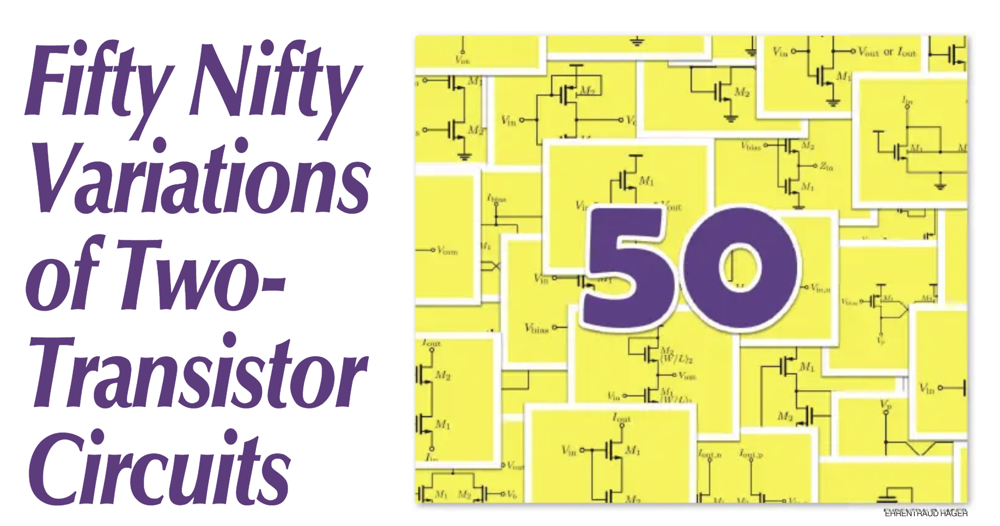

## 投稿動機
2024年の[Chipathon2024](https://ishi-kai.org/information/chipathon/2024/08/31/Entry-SSCS-OSE-CHIPATHON2024.html)のお題が「Fifty-Niftyの回路を自動生成する」というものであり、私もLNAで参戦予定であった。  
しかし、諸事情により、ギブアップすることとなったため、本ミニマルファブコンテスト2024で供養することにしたのである。  
* [Chipathon2024参戦敗北記](https://github.com/noritsuna/AdventCalendar2024/blob/main/OSSSilicon_Day_03.md)

* 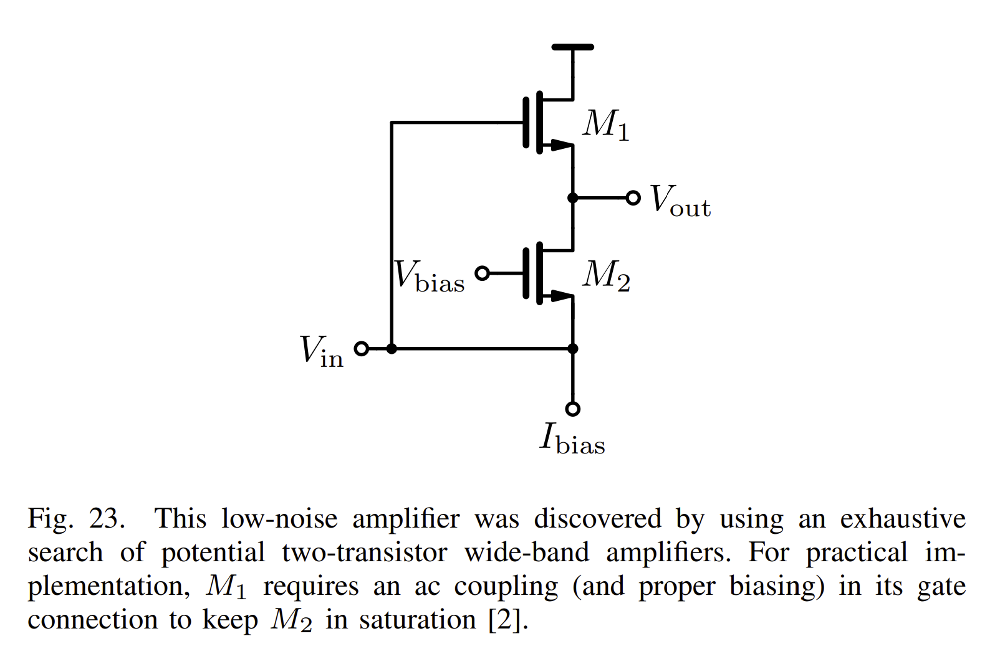
* 
* 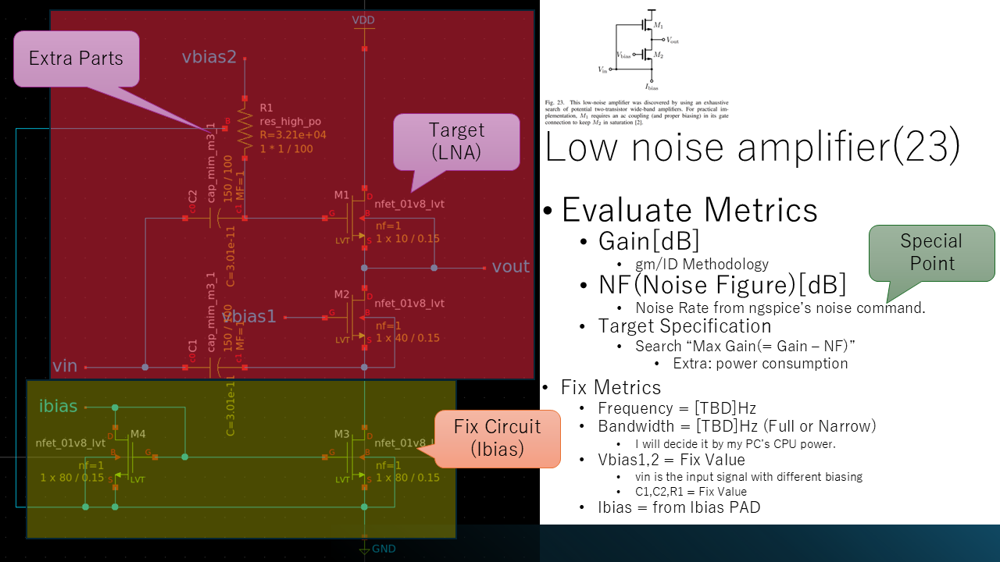
* 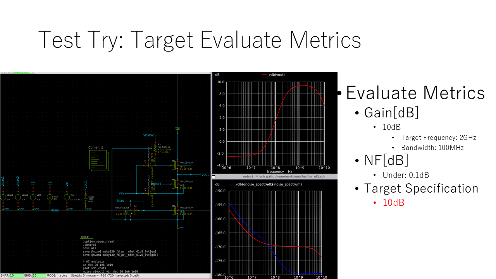
* [エントリーシート](docs/chipathon2024_entry.pdf)

## 提出用ファイル
* [xschemファイル](LNA/lna.sch)
* [テストベンチファイル](LNA/lna_tb.sch)
* [GDSファイル](LNA/lna.gds)

* [各種ファイル保存ディレクトリ](LNA/)

### 提出用ファイル画像
#### 回路図(xschem)
* 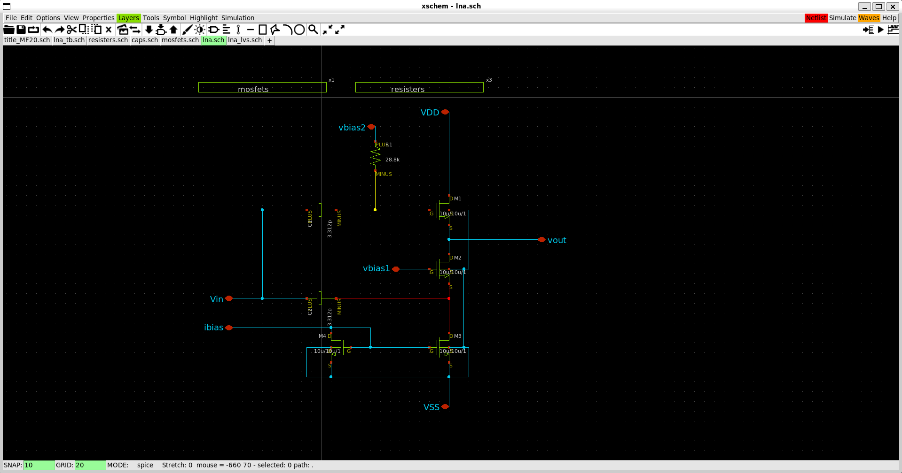
* 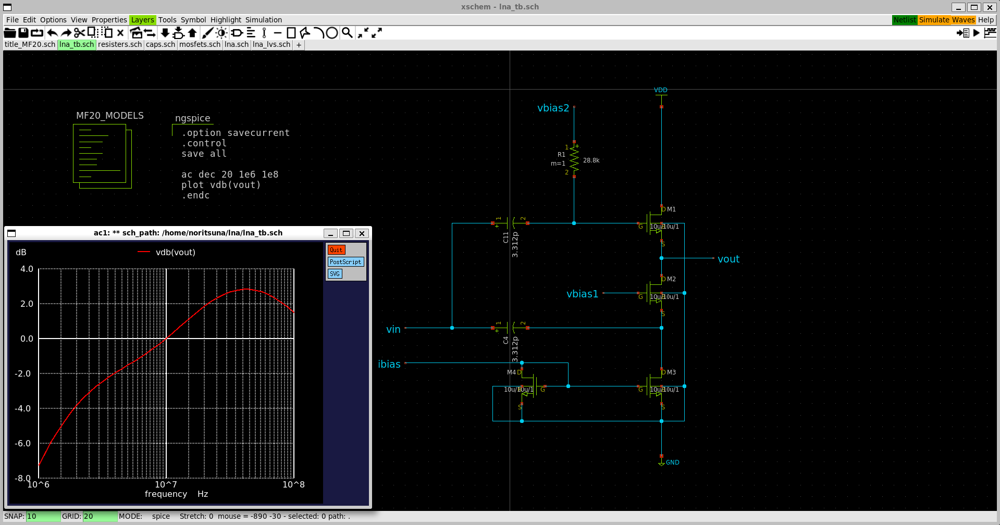
* 
* 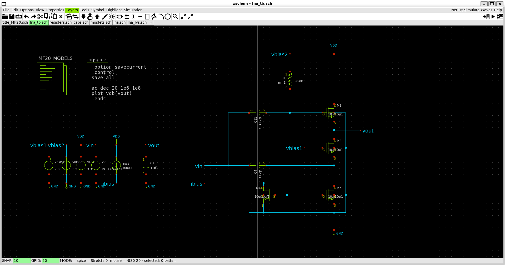

#### レイアウト(klayout)
* 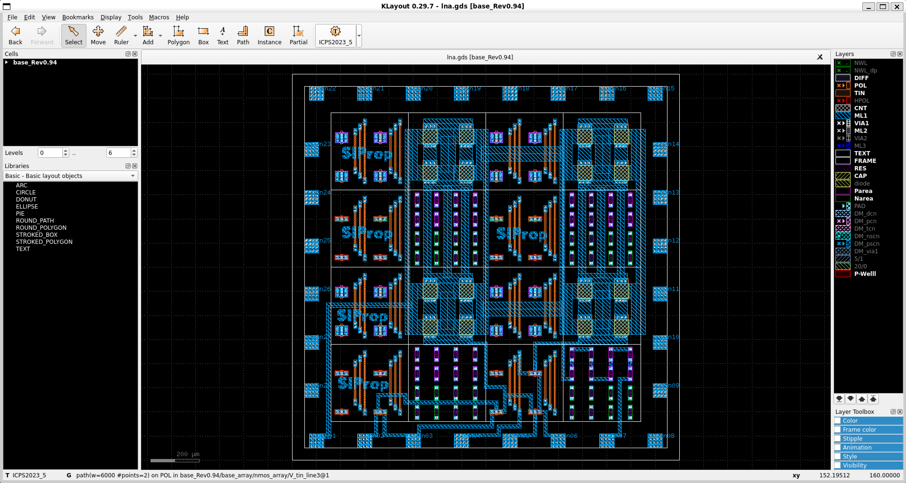
* 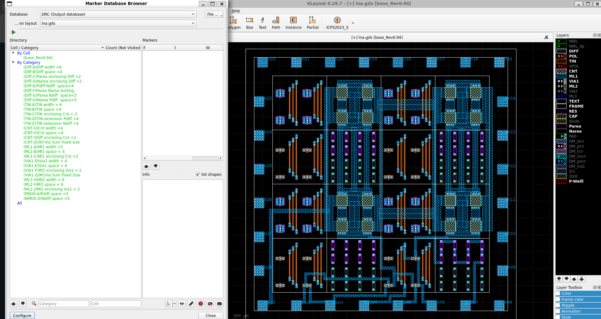
* 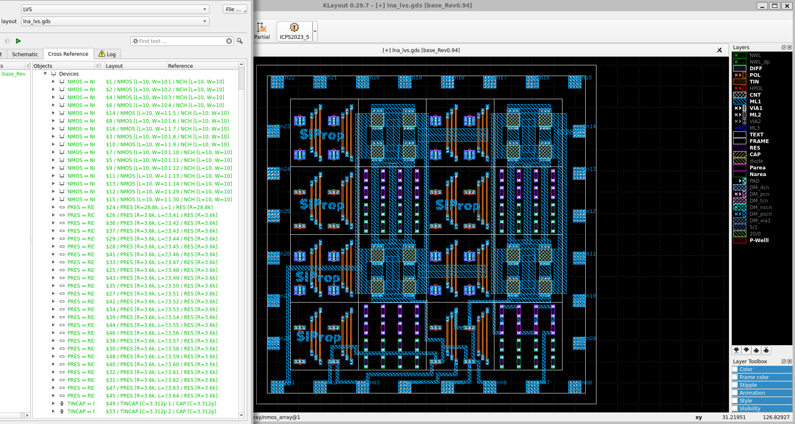

### トラブル
実は、一部トラブルが出ているため、報告する。  
最初に、LVSをしたらNGでた。  
* 

理由は、LVSにおいて、2つのキャパシタの片方のピンが共通のNETにつながっていると「1つのキャパシタ」として認識されてしまうようである。
* 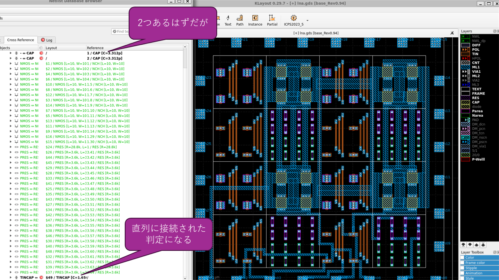

そこで、LVS用に回路図に手を加えた。  
共通のNETを分離した回路図とレイアウトを作成することとした。  
* 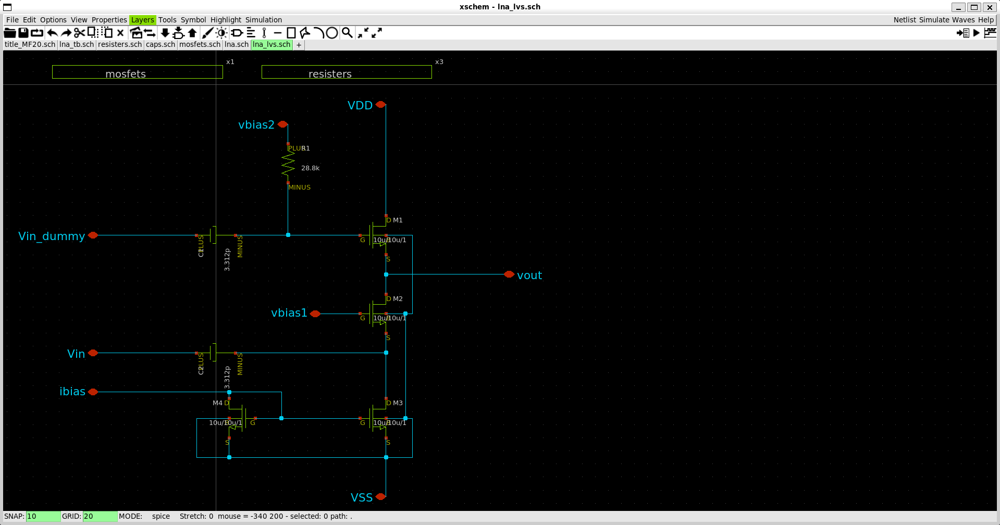
* 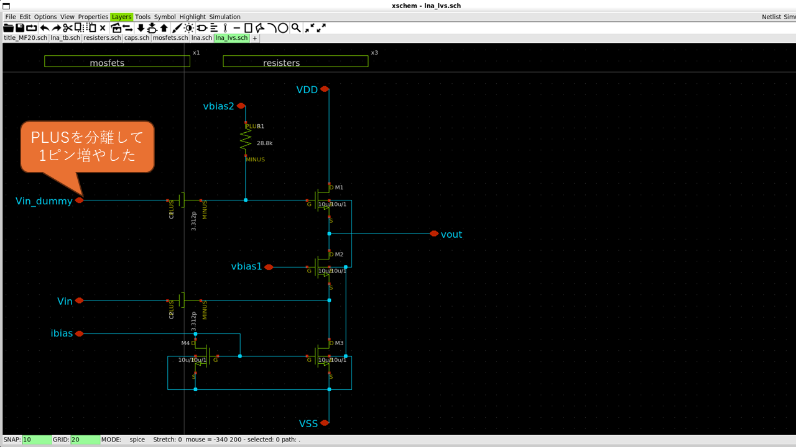
* 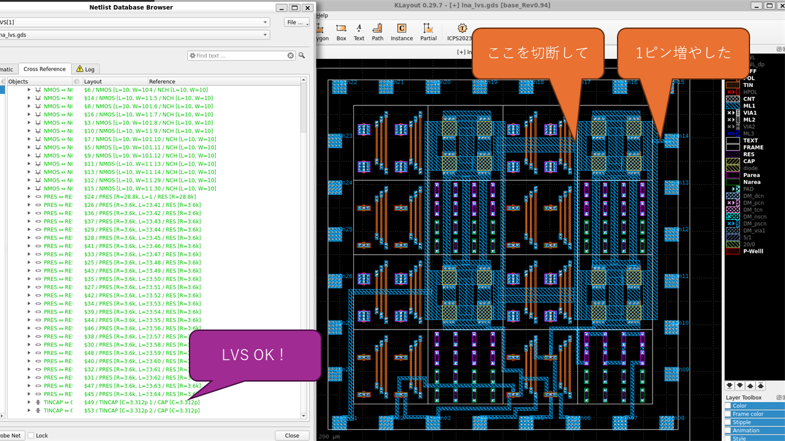
* 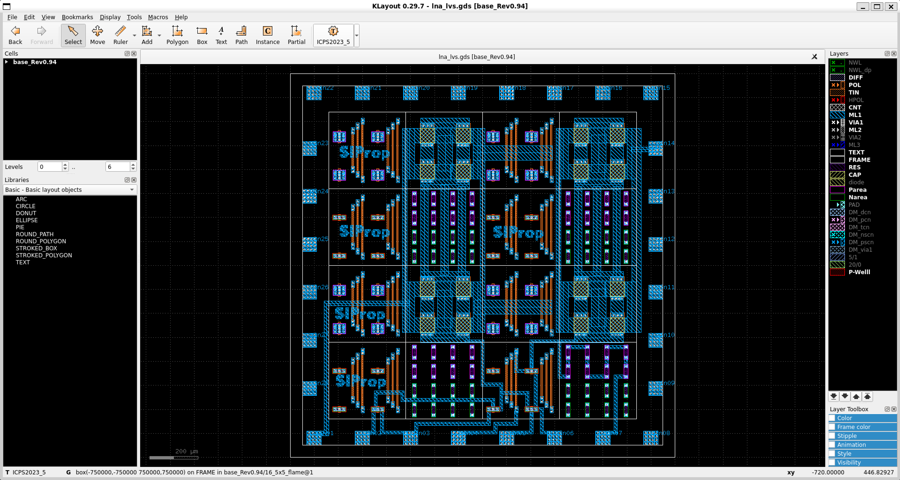

この状態で、LVSがOKになった。
* 
